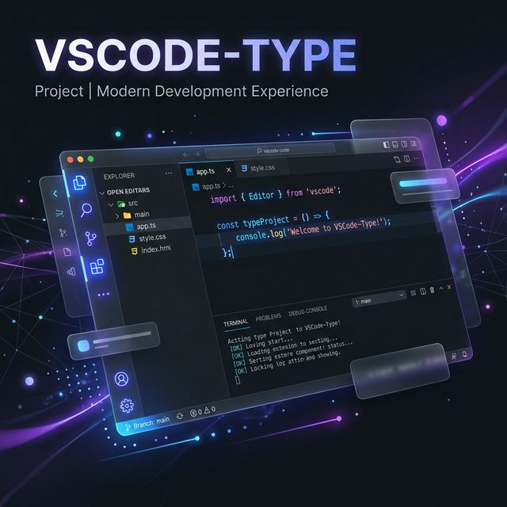

<p align="center">
  
</p>

<h1 align="center">🚀 VSCode-Type</h1>

<p align="center">
  <strong>The Ultimate Engine for Coding Reels & Social Media.</strong>
</p>

<p align="center">
  <a href="https://vscodetype.vercel.app"></a>
  <a href="https://github.com/probs9234/vscodetype"></a>
  
</p>

---

## ✨ Why VSCode-Type?

Traditional screen recordings are messy. **VSCode-Type** provides a pixel-perfect, hyper-realistic Visual Studio Code environment specifically tuned for **Instagram Reels, TikToks, and YouTube Shorts**.

### 🎥 Reel-Ready Features:
- **🎹 Pro Typing Simulation**: Human-like typing with adjustable speeds (Slow to Turbo).
- **🚫 Stealth Recording**: No distracting UI. Play/Pause/Stop controls are hidden in the Status Bar.
- **⚡ Zero-Flicker Rendering**: Full-app memoization ensures a butter-smooth recording area even at 60 FPS.
- **📂 Dynamic Explorer**: Functional file system with VS Code icons and CRUD operations.
- **🎨 Modern Dark Theme**: Deep black backgrounds and high-contrast syntax highlighting for maximum aesthetic impact.

---

## 🛠️ Tech Stack

<p align="left">
  
  
  
  
  
</p>

---

## 🚀 Getting Started

### 1. Clone the repository
```bash
git clone https://github.com/probs9234/vscodetype.git
cd vscodetype
```

### 2. Install dependencies
```bash
npm install
```

### 3. Run Development Server
```bash
npm run dev
```

### 4. Create Your First Reel
- Open the sidebar and click **"RUN REEL"** in the bottom left.
- Watch the simulation type your code with cinematic precision.
- Record with your favorite screen tool!

---

## 📄 License
This project is open-source and ready for the community to build upon.

<p align="center">
  Built with ❤️ by **Probs**
</p>
